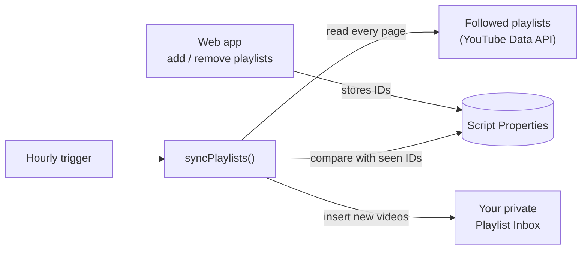

# YouTube Playlist Inbox

**YouTube lets you subscribe to a channel, but not to a playlist.** If you follow a few curated playlists (a conference's talks, a course, a friend's picks), you have to keep checking each one by hand.

This Google Apps Script fixes that. Paste the playlists you want to follow into a small web page, and every hour any new video from any of them lands in one private **Playlist Inbox** playlist on your own YouTube account. Watch it like a subscription feed and remove videos as you go.

[](https://github.com/Jsingh-26/youtube-playlist-inbox/actions/workflows/ci.yml)

## How it works



- **No flood when you follow a playlist.** Adding a playlist marks everything already in it as seen, so only videos added afterwards come through.
- **Reads the whole playlist.** Many playlists add new videos at the end, so the sync pages through all of it instead of only the first 50.
- **Storage that doesn't run out.** Seen video IDs are kept per playlist and split across Script Properties (each value is capped at 9 KB). Videos that leave a followed playlist are forgotten, so storage stays proportional to what you follow.
- **Quota-aware.** Adding a video costs 50 of YouTube's 10,000 daily API units (about 200 videos a day). Each run adds at most 50; if the daily quota runs out, the remaining videos are held back and added on a later run instead of being lost.
- **Safe to run twice.** A script lock stops the hourly sync and a manual run from overlapping.
- **Private by default.** The web app runs as you and only you can open it. Nothing leaves your Google account, and there are no API keys: Apps Script signs in to YouTube for you.

## Setup (about 5 minutes)

1. Create a new project at [script.google.com](https://script.google.com) and copy in the four files from `src/`. Or, with [clasp](https://github.com/google/clasp): copy the new project's Script ID (Project Settings), then
   ```bash
   npm install -g @google/clasp
   clasp login
   cp .clasp.json.example .clasp.json   # paste your Script ID into it
   clasp push --force
   ```
2. In the editor, run `setup` once and approve access to your YouTube account. It creates the private **Playlist Inbox** playlist and the hourly trigger.
3. **Deploy → New deployment → Web app** (execute as *Me*, access *Only myself*), open the URL, and paste the playlists you want to follow.

To change the inbox name, privacy or run frequency, edit `CONFIG` at the top of `src/Code.js`.

## Project layout

| Path | What it is |
|---|---|
| `src/Code.js` | Apps Script: web app endpoints, hourly sync, storage, YouTube calls |
| `src/Logic.js` | Pure logic (ID parsing, new-video detection, storage chunking, migration), shared by Apps Script and the tests |
| `src/index.html` | The web app |
| `src/appsscript.json` | Manifest: YouTube Data API v3 advanced service, web app settings |
| `tests/` | Unit tests for `Logic.js` (Node's built-in test runner, no dependencies) |

```bash
npm test        # 12 tests
npm run check   # syntax check both script files
```

CI runs both on every push.

## Version history

- **1.1** Fixed two bugs in the first version. Seen videos were stored with their titles in a single property, which hit the 9 KB limit after roughly 60–80 videos and made every sync fail. And only the first 50 items of each playlist were read, so new videos at the end of longer playlists were never picked up. Also added the per-run quota cap, the lock, skipping of private and deleted videos, and an automatic migration from the old storage format. The first run after upgrading records everything currently in each followed playlist as seen, because 1.0's history only covered the first 50 items; without that, older videos would flood the inbox.
- **1.0** Web app to manage followed playlists, hourly sync into a private inbox playlist.

## License

MIT
