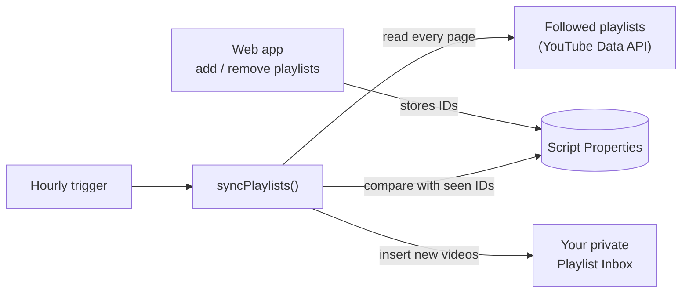

# YouTube Playlist Inbox

Subscribe to YouTube playlists, not just channels: every hour, new videos from the playlists you follow land in one private **Playlist Inbox** playlist on your own account. A Google Apps Script with a small web page to manage what you follow.

[](https://github.com/Jsingh-26/youtube-playlist-inbox/actions/workflows/ci.yml)

**Why:** if you follow a few curated playlists (a conference's talks, a course, a friend's picks), YouTube makes you check each one by hand. This turns them into one feed you watch and clear like a subscription.

There is no screenshot: the web page runs as you and opens only for the signed-in owner.

## How it works



- You paste playlist links into the web page; their IDs are saved in Script Properties.
- An hourly trigger runs `syncPlaylists()`, which reads every page of each followed playlist (not just the first 50 items, since many playlists add new videos at the end).
- Videos not seen before are added to the inbox; private and deleted videos are skipped.
- A script lock stops the hourly sync and a manual run from overlapping.
- Nothing leaves your Google account and there are no API keys: Apps Script signs in to YouTube for you.

## Decisions

- **Seen IDs are split across properties.** Each Script Property value is capped at 9 KB. Version 1.0 kept seen videos (with titles) in one property, which filled up after roughly 60–80 videos and made every sync fail. 1.1 stores only IDs, per playlist, in chunks, and forgets videos that leave a followed playlist, so storage grows with what you follow, not with time.
- **Following a playlist doesn't flood the inbox.** Everything already in a playlist is marked as seen when you add it, so only later videos come through. The same baseline runs on the first sync after upgrading from 1.0, whose history only covered the first 50 items of each playlist.
- **Quota runs out gracefully.** Adding a video costs 50 of YouTube's 10,000 daily API units (about 200 videos a day). Each run adds at most 50; when the daily quota is used up, the rest are held back for a later run instead of being lost.

## Tests and running locally

```bash
npm test        # 13 unit tests for src/Logic.js (Node's built-in test runner, no dependencies)
npm run check   # syntax check of both script files
```

`src/Logic.js` holds the pure logic (ID parsing, new-video detection, storage chunking, migration) shared by Apps Script and the tests. CI runs both commands on every push. Needs Node 22+.

## Setup (about 5 minutes)

1. Create a new project at [script.google.com](https://script.google.com) and copy in the four files from `src/`. Or, with [clasp](https://github.com/google/clasp): copy the new project's Script ID (Project Settings), then
   ```bash
   npm install -g @google/clasp
   clasp login
   cp .clasp.json.example .clasp.json   # paste your Script ID into it
   clasp push --force
   ```
2. In the editor, run `setup` once and approve access to your YouTube account. It creates the private **Playlist Inbox** playlist and the hourly trigger.
3. **Deploy → New deployment → Web app** (execute as *Me*, access *Only myself*), open the URL, and paste the playlists you want to follow.

To change the inbox name, privacy or run frequency, edit `CONFIG` at the top of `src/Code.js`.

Maintenance functions, run from the editor:

- `markAllSeen` records everything currently followed as seen, so only videos added afterwards reach the inbox.
- `removeInboxItemsAddedBetween(startIso, endIso, dryRun)` removes inbox entries added in a time window (to undo a bad batch). It has a dry-run mode and resumes on the next run if the daily quota runs out.

## Project layout

| Path | What it is |
|---|---|
| `src/Code.js` | Apps Script: web app endpoints, hourly sync, storage, YouTube calls |
| `src/Logic.js` | Pure logic, shared by Apps Script and the tests |
| `src/index.html` | The web app |
| `src/appsscript.json` | Manifest: YouTube Data API v3 advanced service, web app settings |
| `tests/` | Unit tests for `Logic.js` |

## Version history

- **1.1** Fixed the 9 KB storage overflow and the 50-item read limit from 1.0. Added the per-run quota cap, the lock, skipping of private and deleted videos, and automatic migration from the old storage format with a baseline on the first run. Since then: `markAllSeen` and `removeInboxItemsAddedBetween`.
- **1.0** Web app to manage followed playlists, hourly sync into a private inbox playlist.

## License

MIT
